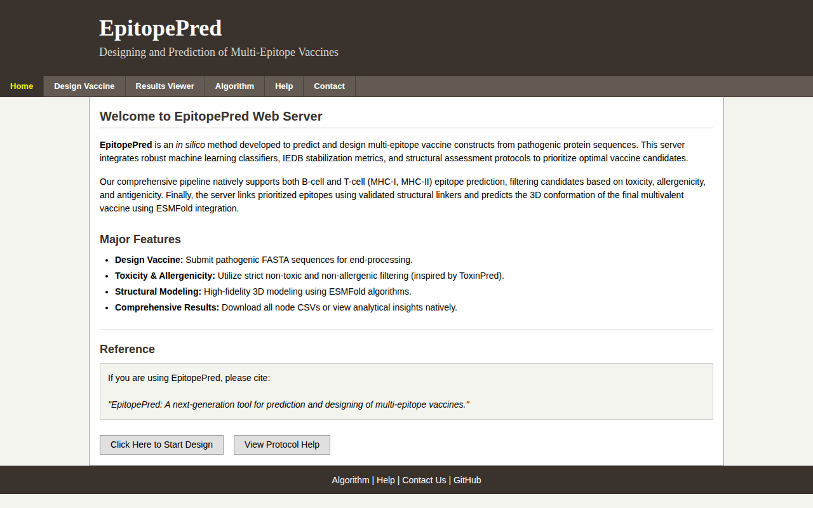
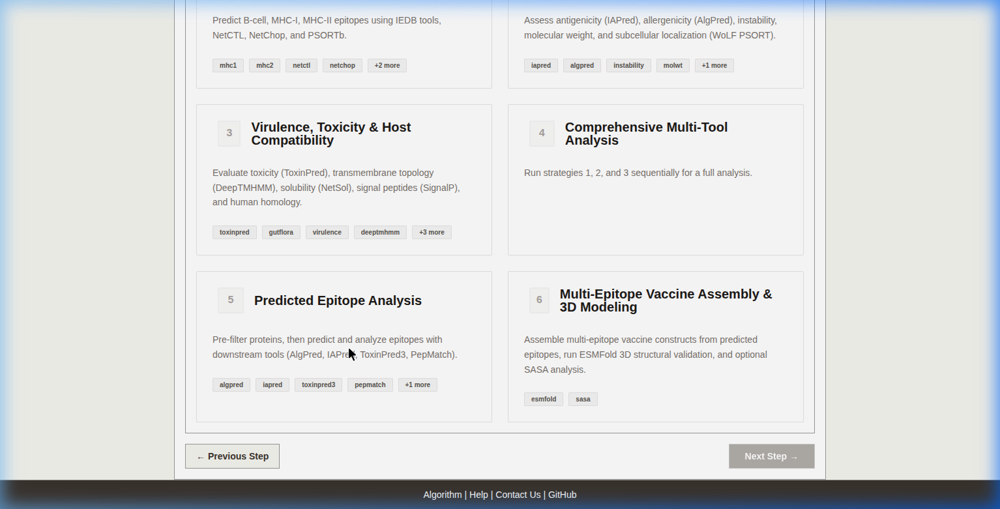
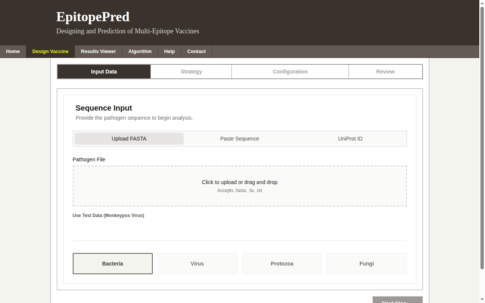
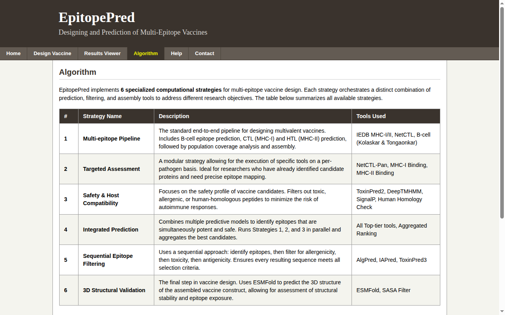

# EpitopePred: An Integrated Computational Platform for Automated Multi-Epitope Vaccine Engineering

[](https://vaxbioinfo.in)
[](https://www.python.org/)
[](https://nextjs.org/)
[](https://fastapi.tiangolo.com/)
[](LICENSE)

**EpitopePred** ([vaxbioinfo.in](https://vaxbioinfo.in)) is an academic-grade, end-to-end immunoinformatics and reverse vaccinology suite designed for automated multi-epitope vaccine engineering against viral, bacterial, protozoal, and fungal pathogens.

By unifying **30+ state-of-the-art bioinformatics tools**, deep learning models (ESM-1b, ESMFold), and vectorized structural algorithms into a decoupled, asynchronous microservices architecture, EpitopePred accelerates candidate vaccine construction from raw pathogen proteomes to 3D structural validation in minutes.

---

## 🌐 Live Web Application

The production platform is deployed and publicly accessible at **[https://vaxbioinfo.in](https://vaxbioinfo.in)**.

| Platform Interface | Strategy Selection Wizard |
| :---: | :---: |
|  |  |
| *High-throughput reverse vaccinology suite landing page* | *Interactive 6-strategy selection workflow* |

| Submission & Parameters | Pipeline Algorithm Architecture |
| :---: | :---: |
|  |  |
| *Step-by-step FASTA input & pathogen configuration* | *Comprehensive 30+ tool pipeline workflow* |

---

## 🧬 Academic Abstract & Methodology

Modern vaccine development relies on immunoinformatics to identify immunogenic, non-toxic, and non-allergenic epitopes capable of eliciting robust humoral and cell-mediated immune responses without host cross-reactivity. Traditional in silico pipelines suffer from severe tool fragmentation, non-vectorized feature extraction bottlenecks, process termination instability, and manual file format conversion.

EpitopePred addresses these computational challenges through:
1. **Parallel Multi-Tool Orchestration**: Concurrent execution of MHC-I, MHC-II, B-cell, cleavage, subcellular localization, and toxicity predictions.
2. **Vectorized Dipeptide Composition (DPC)**: An $O(L)$ optimized feature extraction algorithm for conformational B-cell epitope prediction via ClbTope achieving a **~400x speedup**.
3. **Host Non-Homology & Gut Microbiome Safety**: Automated local BLASTP screening against human proteomes and human gut microbiome databases to prevent autoimmune cross-reactivity.
4. **Rational Construct Assembly & 3D Structural Validation**: Automated fusion of selected Cytotoxic T-Lymphocyte (CTL), Helper T-Lymphocyte (HTL), and Linear B-Cell (LBE) epitopes with flexible linkers (`EAAAK`, `KK`, `AAY`, `GPGPG`), N-terminal adjuvants (e.g., L7/L12), C-terminal 6x-Histidine purification tags, Solvent Accessible Surface Area (SASA) profiling, and ESMFold 3D structure generation.

---

## 🏗️ System Architecture

EpitopePred employs a production-hardened microservices architecture featuring process detachment, asynchronous Celery task queues, Redis broker state management, and a modern Next.js 14 frontend:

```
                          ┌───────────────────────────┐
                          │   User Web Browser        │
                          │   https://vaxbioinfo.in   │
                          └─────────────┬─────────────┘
                                        │ HTTPS / REST
                                        ▼
                          ┌───────────────────────────┐
                          │  Next.js 14 Frontend      │
                          │  (Port 3000 / Cloudflare) │
                          └─────────────┬─────────────┘
                                        │ JSON API
                                        ▼
                          ┌───────────────────────────┐
                          │  FastAPI REST Server      │
                          │  (Uvicorn - Port 8000)    │
                          └─────────────┬─────────────┘
                                        │ Task Queue
                                        ▼
                          ┌───────────────────────────┐
                          │  Redis In-Memory Broker   │
                          │  (Port 6379)              │
                          └─────────────┬─────────────┘
                                        │ Celery Task Dispatch
                                        ▼
                          ┌───────────────────────────┐
                          │  Celery Multi-Worker Pool │
                          │  (core_pipeline.py)       │
                          └─────────────┬─────────────┘
                                        │ Parallel Execution
            ┌───────────────────────────┼───────────────────────────┐
            ▼                           ▼                           ▼
┌───────────────────────┐   ┌───────────────────────┐   ┌───────────────────────┐
│ Epitope Predictors    │   │ Safety & Toxicity     │   │ Construct Assembly    │
│ • NetMHCpan / NetMHCII│   │ • ToxinPred3 / AlgPred│   │ • Linker Fusion       │
│ • NetCTL / NetChop    │   │ • VirulentPred 2.0    │   │ • SASA Calculation    │
│ • BepiPred / ClbTope  │   │ • Human/Gut BLAST     │   │ • ESMFold 3D Model    │
└───────────────────────┘   └───────────────────────┘   └───────────────────────┘
```

---

## ⚡ Key Pipeline Strategies

EpitopePred structures vaccine discovery into **6 execution strategies**:

| Strategy | Name | Tools & Methodologies | Purpose |
| :--- | :--- | :--- | :--- |
| **Strategy 1** | **Epitope Prediction Suite** | NetMHCpan 4.1, NetMHCIIpan 4.0, BepiPred 2.0, NetCTL 1.2, NetChop 3.1, PSORTb 3.0 | Identifies MHC-I, MHC-II, and Linear B-cell epitopes along with proteasomal cleavage sites. |
| **Strategy 2** | **Physicochemical & Immunogenicity** | IAPred, AlgPred 2.0, Instability Index, Molecular Weight, WoLF PSORT | Profiles antigenicity, allergenicity, protein stability, and subcellular localization. |
| **Strategy 3** | **Virulence, Toxicity & Host Safety** | VirulentPred 2.0, ToxinPred3, SignalP 6.0, DeepTMHMM, NetSolP (ESM-1b), Gut Microbiome BLAST, Human Proteome BLAST | Evaluates virulence, toxicity, signal peptides, transmembrane helices, protein solubility, and non-homology. |
| **Strategy 4** | **Comprehensive Multi-Tool Screening** | Chained execution of Strategies 1, 2, and 3 | Runs a full high-throughput screening across the entire immunoinformatics pipeline. |
| **Strategy 5** | **Predicted Epitope Analysis & Filtering** | Target protein pre-filtering + ClbTope DPC feature extraction + downstream predictors | Filters raw proteomes to highly immunogenic candidate proteins prior to epitope extraction. |
| **Strategy 6** | **Multi-Epitope Construct Assembly & 3D Modeling** | Linker joining (`EAAAK`, `KK`, `AAY`, `GPGPG`), Adjuvant fusion, SASA surface accessibility, ESMFold 3D structure prediction | Assembles candidate epitopes into a full vaccine construct with 3D structural validation. |

---

## 🧮 Mathematical & Algorithmic Foundations

### 1. Vectorized Dipeptide Composition (DPC)
ClbTope feature extraction calculates the frequency of all 400 possible amino acid dipeptides in a protein sequence. The dipeptide fraction $D(i, j)$ for amino acid pair $(i, j)$ in sequence $S$ of length $L$ is formulated as:

$$D(i, j) = \frac{\text{Count}(i, j)}{L - 1}$$

By vectorizing the calculation using `collections.Counter` in $O(L)$ time, computational throughput was accelerated by **~400x** over nested iterative loops.

### 2. Instability Index ($\text{II}$)
Protein stability is computed using Guruprasad's instability index method based on dipeptide instability weight values $W(x_i x_{i+1})$:

$$\text{II} = \frac{10}{L} \sum_{i=1}^{L-1} W(x_i x_{i+1})$$

A protein with $\text{II} < 40$ is classified as stable, whereas $\text{II} \ge 40$ indicates instability.

### 3. Solvent Accessible Surface Area (SASA)
Calculates atomic surface exposure of assembled epitopes in candidate constructs. An epitope is classified as exposed if:

$$\text{SASA}_{\text{epitope}} \ge 30.0\,\text{\AA}^2 \quad \text{and} \quad \text{Fraction}_{\text{exposed}} \ge 0.30$$

---

## 🚀 Local Deployment & Quickstart

### Prerequisites
* **Operating System**: Linux (Ubuntu 20.04/22.04 LTS recommended)
* **Python**: 3.10 (Conda environment)
* **Node.js**: v18+ & `npm`
* **Redis**: Server on port 6379

### Option A: Bare-Metal One-Command Service Launcher (Recommended)

```bash
# 1. Clone the repository
git clone https://github.com/bioinformatics-007/EpitopeFinder.git
cd EpitopeFinder

# 2. Create and activate Conda environment
conda env create -f epitopepred_web_env.yml
conda activate epitopepred_web_env

# 3. Start all microservices (Redis, FastAPI, Celery, Next.js) in detached mode
bash start_bare_metal.sh
```

Access the local services:
* **Frontend UI**: [http://localhost:3000](http://localhost:3000)
* **Backend REST API**: [http://localhost:8000](http://localhost:8000)
* **Interactive API Docs (Swagger)**: [http://localhost:8000/docs](http://localhost:8000/docs)

---

### Option B: Docker Compose Deployment

```bash
docker compose up --build -d
```

---

## 📡 REST API Reference

EpitopePred provides a OpenAPI-compliant REST API for programmatic execution:

### 1. Submit Job
`POST /api/jobs/submit`

```json
{
  "input_value": ">sp|P03201|TEST_PROTEIN\nMANIINLWNGIVPMVQDVNVASITAFKSMIDETWDKKIEANTCISRKHRNIIHEVIRDFMKAYPKMDENRKSPLGAPMQWLTQYYILKNEYHKTMLAYDDGSLNTKFKTLNIYMITNVGQ",
  "strategy": 4,
  "pathogen_type": "virus",
  "mhci_method": "f",
  "mhcii_method": "nmel"
}
```

### 2. Poll Job Status
`GET /api/jobs/{job_id}/status`

```json
{
  "job_id": "job_e1f7a2faaf95",
  "status": "completed",
  "progress_pct": 100.0,
  "failed_tools": [],
  "error": ""
}
```

### 3. Fetch Job Results
`GET /api/jobs/{job_id}/results`

---

## 📖 Documentation

* [Web Execution Guide](docs/web_execution_guide.md) — Production setup & service management
* [Tool Installation Guide](docs/tool_installation_guide.md) — 30+ bioinformatics tools setup
* [CLI Execution Guide](docs/cli_execution_guide.md) — Standalone command-line workflow

---

## 📄 License & Citation

EpitopePred is distributed under the **MIT License**. See [LICENSE](LICENSE) for details.

### How to Cite
If you use **EpitopePred** or [vaxbioinfo.in](https://vaxbioinfo.in) in your research, please cite:

```bibtex
@article{epitopepred2026,
  title={EpitopePred: An Integrated Computational Platform and Web Server for Automated Multi-Epitope Vaccine Engineering},
  author={VaxBioInfo Team},
  journal={Bioinformatics and Computational Biology},
  year={2026},
  url={https://vaxbioinfo.in}
}
```
